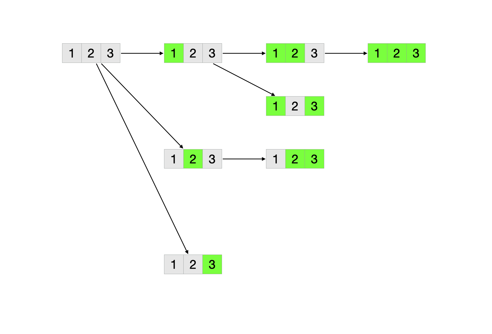
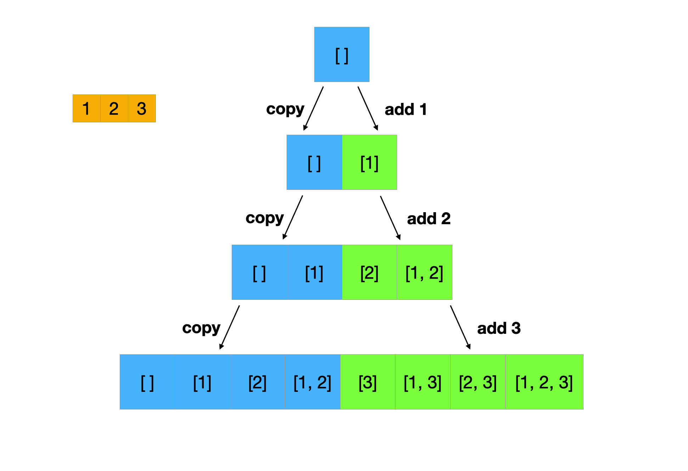
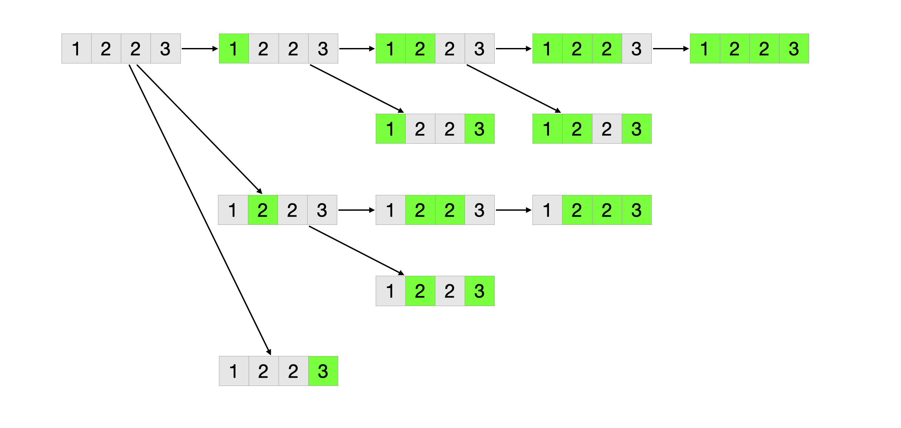
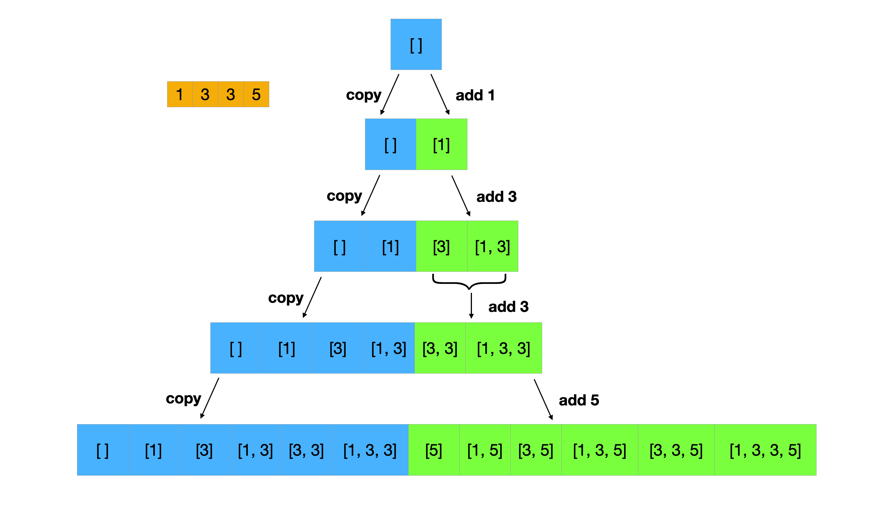
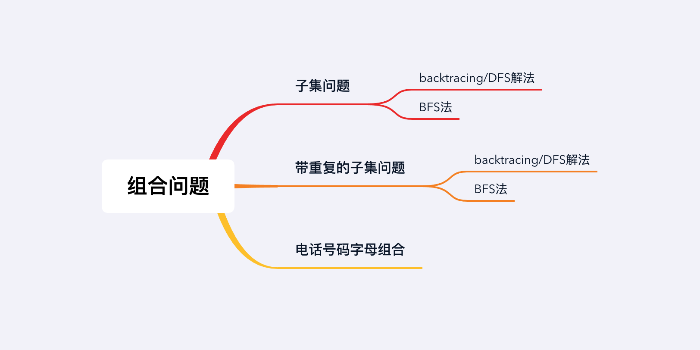

# Day 25 Combination 组合问题

之前我们学的章节都是关注于某种特定的数据结构：链表、树、图、堆等等。本章我们将学习数论一类的算法题。这类算法题的题目描述一般比较抽象，需要我们从题干中分析出我们需要的数据结构与算，然后分析出算法逻辑，并且写代码实现。这类题对面试者的逻辑思维能力要求较高，需要面试人员有扎实的代码基础和一定的数学分析能力。

## 核心算法——组合问题

组合问题一般表述成从n个元素中取出k个元素，可选的组合数量为C<sub>n</sub><sup>k</sup>。组合问题一般不考虑元素的顺序。在算法题中，组合问题一般会表述成子集问题：给定n个元素，取出包含k个元素的子集。

## 1.案例: 子集问题

> 给定一个组整数，返回其所有的子集。
>
> 输入: [1, 3]
> 输出: [], [1], [3], [1,3]

### 思路分析1

子集问题有多种解法，最通用的解法是回溯法。backtracing回溯法是DFS的变种算法，可以用在所有排列组合类的问题上，是排列组合的通用解法。



使用backtracing/DFS解题：从空集合开始，将有效的子集加入最终答案。每次遍历所有可能的元素，选择一个加入当前子集。然后递归的调用dfs。

### 代码实现1

```java
public List<List<Integer>> subsets(int[] nums) {
    List<List<Integer>> ans = new ArrayList<>();
    List<Integer> res = new ArrayList<>();
    dfs(nums, 0, res, ans);
    return ans;
}

void dfs(int[] nums, int idx, List<Integer> res, List<List<Integer>> ans) {
    // 将有效的子集加入最终答案
    ans.add(new ArrayList<>(res));
    // 遍历所有可能的元素
    for (int i = idx; i < nums.length; i++) {
        // 将元素加入当前子集的开头
        res.add(nums[i]);
        // 递归的调用dfs
        dfs(nums, i + 1, res, ans);
        // 移除该元素，回溯状态
        res.remove(res.size() - 1);
    }
}
```

### 思路分析2

除了backtracing/DFS法，BFS也可以解决本题。从空集开始，遍历原数组，每次添加一个元素进入已有的集合。

假设给定的集合为[1, 2, 3]：

1. 初始空集[]
2. 复制已有的集合，并添加元素1，得到[[], [1]]
3. 复制已有的集合，并添加元素2，得到[[], [1], [2], [1, 2]]
4. 复制已有的集合，并添加元素3，得到[[], [1], [2], [1, 2], [3], [1, 3], [2, 3], [1, 2, 3]]



### 代码实现2

```java
public List<List<Integer>> subsets(int[] nums) {
    List<List<Integer>> ans = new ArrayList<>();
    // 添加初始空集
    ans.add(new ArrayList<>());
    // 遍历原数组，每次添加一个元素进入已有的集合
    for (int n : nums) {
        int size = ans.size();
        for (int i = 0 ; i < size; i++) {
            // 复制已有的集合
            List<Integer> copy = new ArrayList<>(ans.get(i));
            // 添加元素
            copy.add(n);
            // 将新的集合加入答案
            ans.add(copy);
        }
    }
    return ans;
}
```

### 分析
时间复杂度O(n * 2<sup>n</sup>)，空间复杂度O(n * 2<sup>n</sup>)。组合问题的规模根据输入大小，成指数增长。

## 2.案例: 子集问题2

> 给定一个组可能重复的整数，返回其所有的子集。
>
> 输入: [1, 5, 3, 3]
> 输出: [], [1], [5], [3], [1,5], [1,3], [5,3], [1,5,3], [3,3], [1,3,3], [3,3,5], [1,5,3,3]

### 思路分析1

本题与上一题相似，但是加入了重复元素。作为排列组合的通用解法，回溯法只需要加入一行判断就可以解决这种情况。

1. 将给出的数组排序
2. 从空集合开始，将有效的子集加入最终答案。
3. 每次遍历所有可能的元素，如果当前元素与前一位元素相同，直接跳过当前元素，避免重复子集。选择一个元素加入当前子集。
4. 递归的调用dfs。



### 代码实现1

```java
public List<List<Integer>> subsetsWithDup(int[] nums) {
    // 排序数组
    Arrays.sort(nums);
    List<List<Integer>> ans = new ArrayList<>();
    List<Integer> res = new ArrayList<>();
    dfs(nums, 0, res, ans);
    return ans;
}

void dfs(int[] nums, int idx, List<Integer> res, List<List<Integer>> ans) {
    // 将有效的子集加入最终答案
    ans.add(new ArrayList<>(res));
    // 遍历所有可能的元素
    for (int i = idx; i < nums.length; i++) {
        // 当前元素与前一位元素相同，直接跳过当前元素，避免重复子集
        if (i != idx && nums[i] == nums[i-1]) {
            continue;
        }
        // 将元素加入当前子集的开头
        res.add(nums[i]);
        // 递归的调用dfs
        dfs(nums, i + 1, res, ans);
        // 移除该元素，回溯状态
        res.remove(res.size() - 1);
    }
}
```

### 思路分析2

不同于backtracing法，BFS虽然也可以解决本题，但是需要做更多的修改来处理重复。

将原数组排序。然后从空集开始，遍历原数组。如果是新的元素，添加元素进入已有的集合。如果是重复的元素，添加元素进入上一步新创建的集合。

假设给定的集合为[1, 5, 3, 3]：

1. 将原数组排序[1, 3, 3, 5]
2. 初始空集[]
3. 复制已有的集合，并添加元素1，得到[[], [1]]
4. 复制已有的集合，并添加元素3，得到[[], [1], [3], [1, 3]]
5. 复制已有的集合，并添加元素3到上一步创建的集合，得到[[], [1], [3], [1, 3], [3, 3], [1, 3, 3]]
6. 复制已有的集合，并添加元素5，得到[[], [1], [3], [1, 3], [3, 3], [1, 3, 3], [5], [1, 5], [3, 5], [1, 3, 5], [3, 3, 5], [1, 3, 3, 5]]




### 代码实现2

```java
public List<List<Integer>> subsetsWithDup(int[] nums) {
    // 排序数组
    Arrays.sort(nums);
    List<List<Integer>> ans = new ArrayList<>();
    // 添加初始空集
    ans.add(new ArrayList<>());
    int start = 0, end = 1;
    // 遍历原数组，每次添加一个元素
    for (int i = 0; i < nums.length; i++) {
        // start指向所有元素的首位
        start = 0;
        // 当前元素与前一位元素相同
        if (i != 0 && nums[i] == nums[i-1]) {
            // start指向上一步创建的集合
            start = end;
        }
        // end指向所有元素的末位
        end = ans.size();
        for (int j = start; j < end; j++) {
            // 复制已有的集合
            List<Integer> copy = new ArrayList<>(ans.get(j));
            // 添加元素
            copy.add(nums[i]);
            // 将新的集合加入答案
            ans.add(copy);
        }
    }
    return ans;
}
```

### 分析
时间复杂度O(n * 2<sup>n</sup>)，空间复杂度O(n * 2<sup>n</sup>)。组合问题的规模根据输入大小，成指数增长。

## 3.案例: 电话号码的字母组合

> 给一个不包含0和1的数字字符串，按照电话按键每个数字代表一个字母，请返回其所有可能的字母组合。
>
> 输入: 3
> 输出: ["d", "e", "f"]

电话按键:

|1|2<br>ABC|3<br>DEF|
|:--:|:--:|:--:|
|**4<br>GHI**|**5<br>JKL**|**6<br>MNO**|
|**7<br>PQRS**|**8<br>TUV**|**9<br>WXYZ**|
|*|**0**|#|

### 思路分析

本题是组合问题的变种题（虽然题目叫做电话字母组合，但是并没有什么真正的组合在里面）。我们需要修改backtracing/DFS算法，而不是生硬地套用模板。

1. 如果输入的数字串为空，返回空列表
2. 存储各个数字对应的字母
3. 对数字串逐位找出可以选用的每个字母，分别递归调用dfs
4. 当前位置达到数字串末尾时，将current添加到答案集合，回溯

### 代码实现

```java
public List<String> letterCombinations(String digits) {
    // 建立数字到字母的映射
    String[] board = {"", "", "abc", "def", "ghi", "jkl", "mno", "pqrs", "tuv", "wxyz"};
    List<String> ans = new ArrayList<>();
    // 输入的数字串为空，返回空列表
    if (digits.length() == 0) {
        return ans;
    }
    dfs(0, "", digits, board, ans);
    return ans;
}

void dfs(int idx, String curt, String digits, String[] board, List<String> ans){
    // 当前位置达到数字串末尾时，将current添加到答案集合
    if (idx == digits.length()) {
        ans.add(curt);
        return;
    }
    // 找出可以选用的每个字母，分别递归调用dfs
    int d = digits.charAt(idx) - '0';
    for (char c : board[d].toCharArray()) {
        dfs(idx + 1, curt + c, digits, board, ans);
    }
}
```


### 分析
时间复杂度O(4<sup>n</sup>)，空间复杂度O(4<sup>n</sup>)。每个数字最多对应4个可能的字母。

## 总结

组合问题是数论类题目中最基础的一种。从本章的题目我们可以看出，对于数论类问题，大多数题目仅仅是以数学理论作为题目背景。题目本身依然是围绕DFS/BFS等基础算法出题。因此，对于面试时遇上数论题题目不需要过度紧张。解决这类题目不需要过于高深的数学知识，而是需要扎实的代码基础。


